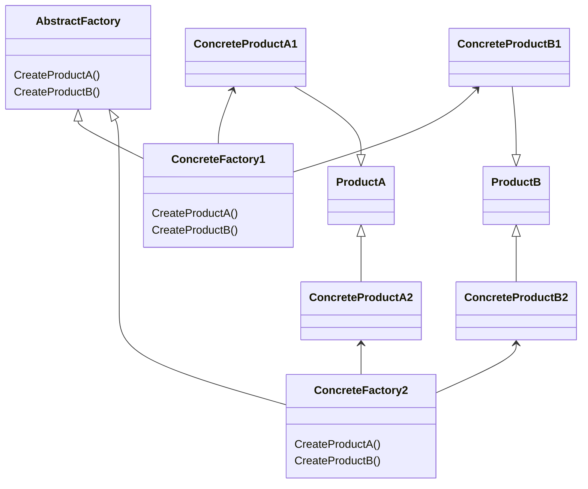

# DZ_DesignPatterns

## Abstract Factory

Паттерн "Абстрактна фабрика" (Abstract Factory) це паттерн що породжує, який дозволяє створювати сімейства пов'язаних об'єктів, не прив'язуючись до конкретних класів об'єктів, що створюються.

Абстрактну фабрику потрібно використовувати:
1.	Коли система не повинна залежати від способу створення та компонування нових об'єктів;
2.	Коли об'єкти, що створюються, повинні використовуватися разом і є взаємопов'язаними.

Паттерн визначає наступних учасників:

-	Абстрактні класи: ProductA та ProductB визначають інтерфейс для класів, об'єкти яких створюватимуться у програмі;
-	Конкретні класи ConcreteProductA1/ConcreteProductA2 та ConcreteProductB1/ConcreteProductB2 представляють конкретну реалізацію абстрактних класів;
-	Абстрактний клас фабрики AbstractFactory визначає методи створення об'єктів. Причому методи повертають абстрактні продукти;
-	Конкретні класи фабрик ConcreteFactory1 та ConcreteFactory2 реалізують абстрактні методи базового класу та безпосередньо визначають які конкретні продукти використовувати.

