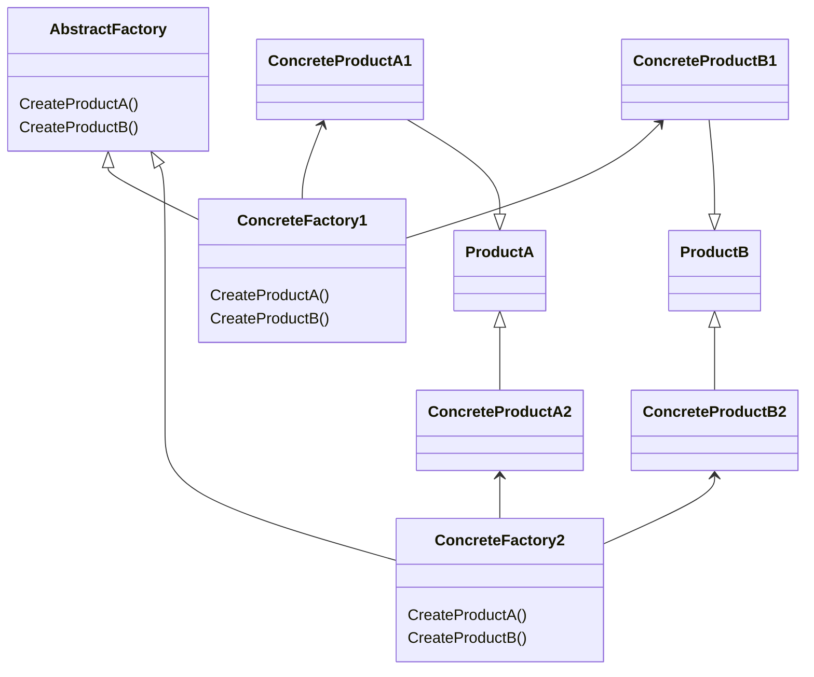
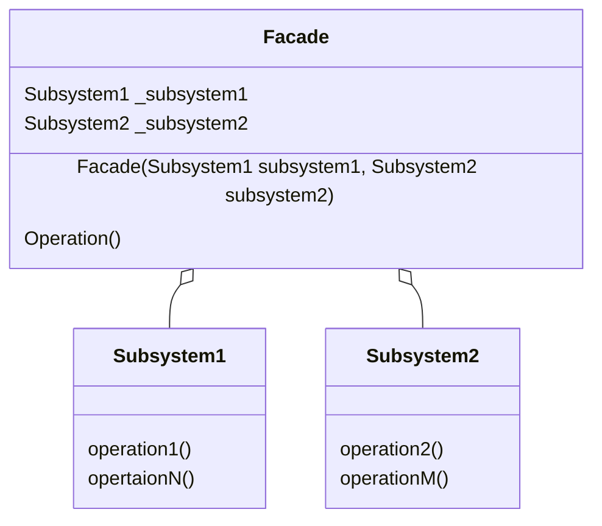
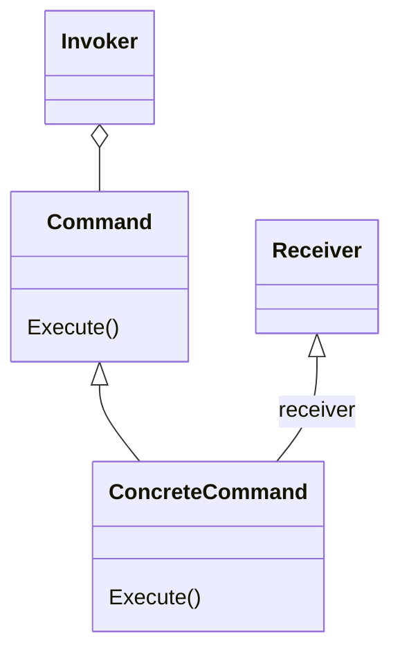

# DZ_DesignPatterns

## Abstract Factory

Паттерн "Абстрактна фабрика" (Abstract Factory) це паттерн що породжує, який дозволяє створювати сімейства пов'язаних об'єктів, не прив'язуючись до конкретних класів об'єктів, що створюються.

Абстрактну фабрику потрібно використовувати:
1.	Коли система не повинна залежати від способу створення та компонування нових об'єктів;
2.	Коли об'єкти, що створюються, повинні використовуватися разом і є взаємопов'язаними.

Паттерн визначає наступних учасників:

-	Абстрактні класи: ProductA та ProductB визначають інтерфейс для класів, об'єкти яких створюватимуться у програмі;
-	Конкретні класи ConcreteProductA1/ConcreteProductA2 та ConcreteProductB1/ConcreteProductB2 представляють конкретну реалізацію абстрактних класів;
-	Абстрактний клас фабрики AbstractFactory визначає методи створення об'єктів. Причому методи повертають абстрактні продукти;
-	Конкретні класи фабрик ConcreteFactory1 та ConcreteFactory2 реалізують абстрактні методи базового класу та безпосередньо визначають які конкретні продукти використовувати.

## Facade

Фасад (Facade) є шаблоном проектування, який дозволяє приховати складність системи за допомогою надання спрощеного інтерфейсу для взаємодії з нею.

Фасад потрібно використовувати:
1.	Коли є складна система, та необхідно спростити з нею роботу. Фасад дозволить визначити одну точку взаємодії між клієнтом та системою;
2.	Коли треба зменшити кількість залежностей між клієнтом та складною системою. Фасадні об'єкти дозволяють відокремити, ізолювати компоненти системи від клієнта та розвивати та працювати з ними незалежно;
3.	Коли потрібно визначити підсистеми компонентів у складній системі. Створення фасадів для компонентів кожної окремої підсистеми дозволить спростити взаємодію між ними та підвищити їхню незалежність один від одного.

Паттерн визначає наступних учасників:
-	Класи Subsystem1, Subsystem2 і т.д. є компонентами складної підсистеми, з якими має взаємодіяти клієнт;
-	Facade – безпосередньо фасад, який надає інтерфейс клієнту для роботи з компонентами.

## Command

Паттерн Команда (Command) дозволяє інкапсулювати запит на виконання певної дії у вигляді окремого об'єкта. Цей об'єкт запиту на дію називається командою. При цьому об'єкти, які ініціюють запити на виконання дії, відокремлюються від об'єктів, які виконують цю дію.
Команди можуть використовувати параметри, що передають асоційовану з командою інформацію. Крім того, команди можуть ставитися в чергу і можуть бути скасовані.

Команду потрібно використовувати:
1.	Коли треба передавати як параметри певні дії, що викликаються у відповідь інші дії. Тобто коли необхідні функції зворотного впливу у відповідь певні дії;
2.	Коли необхідно забезпечити виконання черги запитів, а також їхнє можливе скасування;
3.	Коли треба підтримувати логування змін у результаті запитів. Використання ліг може допомогти відновити стан системи – для цього необхідно буде використовувати послідовність запротоколованих команд.

Паттерн визначає наступних учасників:
-	Command: абстрактний клас, який представляє команду. Зазвичай визначає метод Execute() для виконання дії;
-	ConcreteCommand: конкретна реалізація команди, що реалізує метод Execute(), в якому викликається певний метод, визначений у класі Receiver;
-	Receiver: одержувач команди. Визначає дії, які слід виконувати в результаті запиту;
-	Invoker: ініціатор команди – викликає команду для виконання певного запиту.

